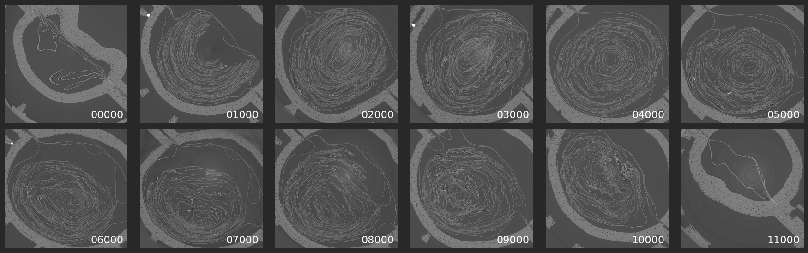
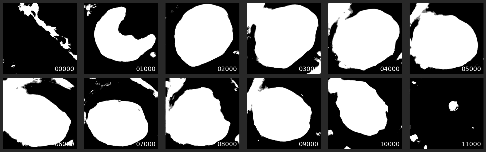
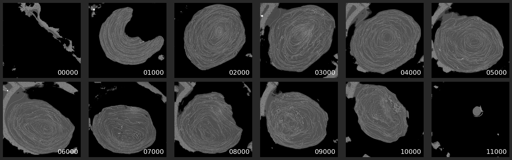

## 2D TIF Volume Masking using nnUNetv2

This repository contains a pipeline for masking 2D TIF slices of a scroll using a trained nnUNetv2 model.

**Why this tool?** Provides fast and easy masking capability for TIFF volumes to significantly reduce storage size for
further scroll analysis. Unlike simple thresholding techniques that fail across different scroll conditions, our
nnUNetv2-based approach delivers robust segmentation across various scroll datasets.

### Results

Our `fast_masking.py` script processes raw scroll volumes to generate precise masks and masked volumes:

**Original Volume (Raw TIF slices)**



**Generated Mask (Binary segmentation)**


**Masked Volume (Background removed)**



**Performance**: Scroll 4 volume (11,174 slices, 240GB uint16) → processed in ~2 minutes on RTX4090 (24GB) + 96GB RAM +
32 cores. Output size reduced to 120GB (50% compression).

### Roadmap

- **Enhanced model**: Improve mask segmentation accuracy beyond initial baseline
- **Multi-format support**: TIF/Zarr/OME-Zarr input/output with configurable bit depth conversion (16→8 bit)
- **Compressed masks**: Zarr/OME-Zarr mask storage with optimized bit depth (1-2 bit)

### Requirements

- Python 3.12
- nnUNetv2
- CUDA-compatible GPU (recommended)

### Installation

1. Clone the repository:

```bash
git clone https://github.com/mvrcii/mask_2d_tif_volume.git
cd mask_2d_tif_volume
```

2. Setup the environment:

```bash
python setup.py
```

### Getting Started

3. Download Sean's nnUNetv2 mask model
   from [here](https://dl.ash2txt.org/community-uploads/bruniss/nnunet_models/nnUNet_results/Dataset082_scrollmask2/nnUNetTrainerWorkshop__nnUNetPlans__2d/),
   put it into `models/nnUNetTrainerV2__nnUNetPlans__2d` and make sure to rename the model folder from
   `nnUNetTrainerWorkshop__nnUNetPlans__2d` to `nnUNetTrainerV2__nnUNetPlans__2d` (essentially removing the "Workshop")

3. Download the raw tif files for any volume:

```bash
python download_volume.py --data-dir /home/<user>/scrollprize/data \
--source https://dl.ash2txt.org/full-scrolls/Scroll4/PHerc1667.volpkg/volumes/20231117161658 \
--target /home/<user>/scrollprize/data/scroll4.volpkg/volumes/20231117161658
```

4. Mask the tif volume:

```bash
python fast_masking.py --input-dir /home/<user>/scrollprize/data/scroll4.volpkg/volumes/20231117161658
```

5. Optional: Convert the masked tif volume to an uint8 ome-zarr using Khartes `scroll_to_zarr.py` script:

```bash
python python scroll_to_zarr.py /home/<user>/scrollprize/data/scroll4.volpkg/volumes/20231117161658_masked /home/<user>/scrollprize/data/scroll4.volpkg/volumes/20231117161658_masked_uint8.zarr --obytes 1
```